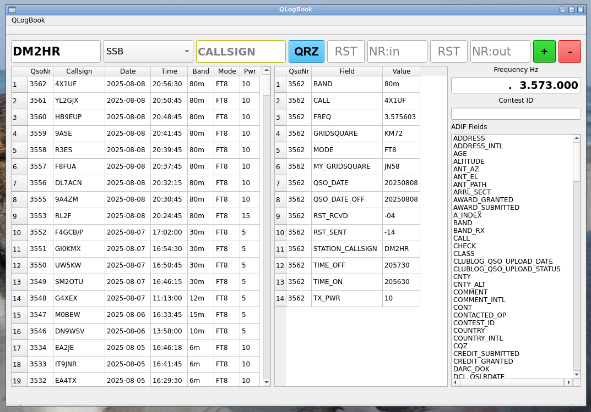

# QLogBook
Ham Logbook with sqlite3 Database, adif (V3.1.6 without userdefined fields yet) im- and export, cabrillo (v3.0) export, and direct tcp connection to hamlib, contest logging with number increment, distance calculation, dynamically created database with automatic backup possibility

## Qt6 based
written for linux, should run also on Windows and MacOS 

## requirements:
- sqlite 3.49.100 (best compile from source)
- Qt6 (>=6.7.2)

## build it:

    mkdir build
    cd build

### for ubuntu (manual install of qt6):
    /opt/Qt/6.7.2/gcc_64/bin/qmake6 ../QLogBook.pro
### for Debian(13):
    /usr/lib/qt6/bin/qmake6 ../QLogBook.pro
		
### maybe obsolete: if app crashes then, alter your Makefile (seems to be an issue with oldstyle char* []): 
Yes, i know, this sounds strange, but this is sadley to say true! 
In Your Makefile, at the top, there are two Lines, with CXXFLAGS and CFLAGS 
Change the PHRASE "-O2" to "-g" - thats all you need. 
  (i can not debug it, since the error is not existing in an built-for-debugging binary, so the optimization causes the issue) 
 TODO: test if the issue is still existing.

After that do a: 

    make
	
now, in your build directory is the runnable binary: QLogBook, you can start it with 
    
	./QLogBook

## Importing many adif files on commandline:
`for i in *.adif ; do QLogBook -I $i ; done`

## Adding fields to qso
double click one element in the list of adif fields 

## change value in qso
double click on value opens editor

## delete value of qso
right click - delete

## export adif
first mark range of qso's to export with click(begin) and shift-click(end), then select menu export

## Questions: dm2hr@hmro.de
vy 73 Matthias DM2HR
